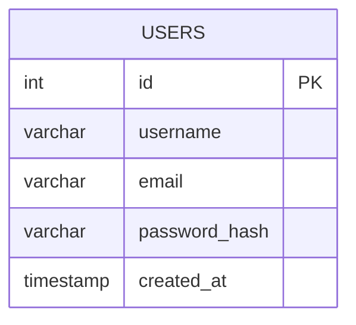

# Data Model for Account Creation

## ER Diagram for `users` Table

## Table Structure and Relationships

### `users` Table
- **id**: Primary Key, Auto-incremented integer
- **username**: String, Required, Unique, Minimum length: 3, Maximum length: 32
- **email**: String, Required, Unique, Valid email format
- **password_hash**: String, Required
- **created_at**: Timestamp, Required, Default: Current timestamp
